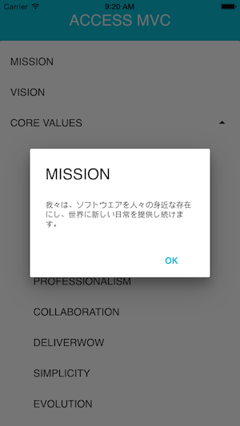

# Material MVC

This is the mobile application that allow us to check MVC(mission, vision, core values) of ACCESS, CO LTD anytime, anywhere

This application is created with Apache cordova and material-ui.
This app uses cordova plugin [cordova-plugin-mvc](http://gitbucket.tok.access-company.com:8080/hiroki.kumamoto/cordova-plugin-mvc) to get mvc statements with native bridge, check it out!



## How to build

### Install dev tools

- Install node and npm
- Install node libraries:

```
$ npm install
```

### Setup project

Run the following command only one time.

```
$ node_modules/gulp/bin/gulp.js cordova:prepare
```

### Build the app

```
$ node_modules/gulp/bin/gulp.js webpack
$ node_modules/gulp/bin/gulp.js cordova:build
```

### Run android or ios

```
$ node_modules/gulp/bin/gulp.js cordova:run_android
```

or

```
$ node_modules/gulp/bin/gulp.js cordova:run_ios
```

